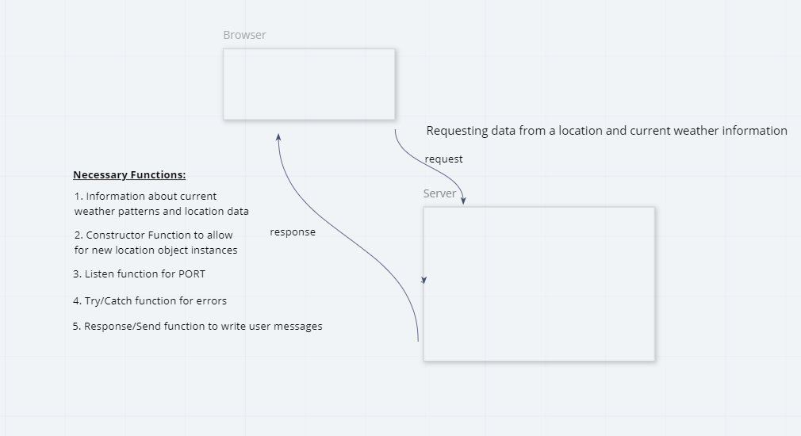

# Lab: 06 - Node, npm, and Express

**Author**: Daisy Johnson
**Version**: 1.0.0

## Overview
Creating a app that shows the user information stored in data files after searching for certain cities.

## Getting Started
1. Set up data tree with data files, .eslint file, .gitignore file, package.json file and server.js file. Then NPM install .env, express and cors. Add server information into server.js and deploy on heroku.

## Architecture
Built with JQuery and Node.js

## Change Log
Server up and running 3:00 pm 6/8/2020
lab finished 5:00 pm 6/8/2020

## Credits and Collaborations

Number and name of feature: Feature 1 Repository Set Up
Estimate of time needed to complete: 30 min

Start time: 2:00

Finish time: 2:25

Actual time needed to complete: 25 minutes

Number and name of feature: Feature 2 Location
Estimate of time needed to complete: 1 hour

Start time: 2:30

Finish time: 3:15

Actual time needed to complete: 45 minutes

Number and name of feature: Feature 3 Weather
Estimate of time needed to complete: 1. 5 hour

Start time: 3:15

Finish time: 4:30

Actual time needed to complete: 1 hour 15 minutes

Number and name of feature: Feature 4 Error Handling
Estimate of time needed to complete: 30 min

Start time: 4:30

Finish time: 5:00

Actual time needed to complete: 30 minutes

6/9/2020
# Lab 07

Number and name of feature: Feature 1 Data formatting

Estimate of time needed to complete: 1 hour

Start time: 3:00 p.m.

Finish time: 3:30 p.m
Actual time needed to complete: 30 min

Number and name of feature: Feature 2 Locations
Estimate of time needed to complete: 45 min

Start time: 3:30p.m.

Finish time: 4:00 p.m.

Actual time needed to complete: 30 min

Number and name of feature: Feature 3 Weather

Estimate of time needed to complete: 1 hour

Start time: 4:00pm

Finish time: 4:45pm
Actual time needed to complete: 45 min

Number and name of feature:Feature 4 Trails
Estimate of time needed to complete: 2 hours

Start time:4:45pm

Finish time:5:50 pm

Actual time needed to complete: 1 hour 5 minutes

[6/9/2020 Partner Whiteboarding](whiteboard2.png)

6/10/20
# LAB 08

Number and name of feature: Feature 1 Database
Estimate of time needed to complete: 1 hour

Start time: 3:00 p.m.

Finish time: 4:00 p.m
Actual time needed to complete: 1 hour

Number and name of feature: Feature 2 Server

Estimate of time needed to complete: 2 hours

Start time: 4:00 p.m.

Finish time: 6:00 p.m
Actual time needed to complete: 2 hours

Number and name of feature: Feature 3 Deploy

Estimate of time needed to complete: 30 min

Start time: 1:30 pm (6/11/20)

Finish time: 2:00 pm
Actual time needed to complete: 30 min

[6/10/2020 Partner Whiteboarding](whiteboard3.png)
